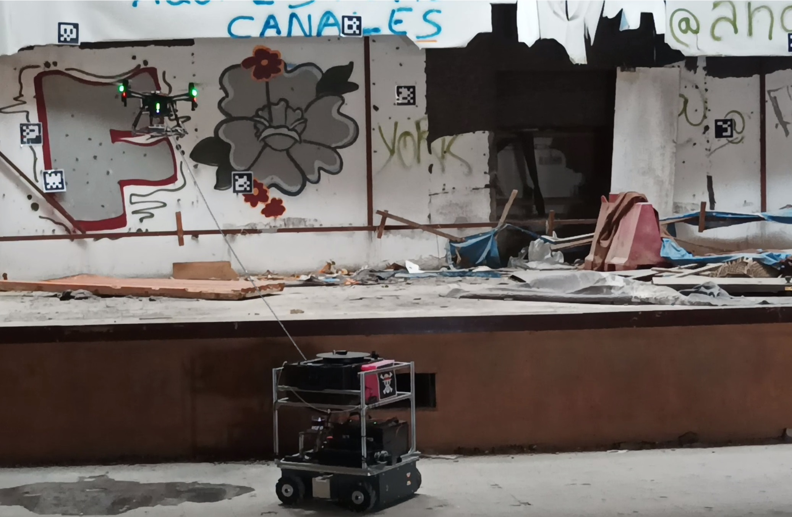

# marsupial_launchers


This repository has all the top level ROS launch files for managing the multi-robot Marsupial system developed by the Service Robotics Laboratorio at the University Pablo de Olavide, Seville (Spain)

Additionally, it has the necessary launch files for replicating the experiments presented in our paper:

Martínez-Rozas, S., Alejo, D., Carpio, J. J., Caballero, F., & Merino, L. (2025). Long Duration Inspection of GNSS-Denied Environments with a Tethered UAV-UGV Marsupial System. Submitted to Drones (MDPI).

The dataset associated to the experiments presented in the paper is available at: (https://robotics.upo.es/dataset)

Please find the instructions to replicate the experiments below.




## Requirements

Ubuntu 18.04 or 20.04, with ROS melodic or noetic, respectively. 
In a machine with ROS, please use the maruspial_installation.sh script to install the required dependencies and generate a "marsupial_ws" Catkin Workspace with the required github repositories cloned.

It will try to build the catkin workspace afterwards.

(In process) Please find our Docker for an easy execution of the code


## Replicating the experients

All the launch files for obtaining the results presented in the paper can be found in the folder experiments_paper_drones.

Again, please find the dataset at: (https://robotics.upo.es/dataset)

Please find additional instructions to each 

### Long endurance experiments

We exported the data of the ground batteries (topic /battery) and the internal UAV battery (/dji_sdk/battery_state) with the timestamp to CSV. We used this data to obtain the plot in the paper.

### Localization experiments

The results presented in experiments 4 and 5 can be replicated by using the localization_4.launch and localization_5.launch file. To this end, please put the bags in the folder '$HOME/experiments'. You have to select the localization method and it will output the execution time (in microseconds) and the mean distance to obstacle of the LiDAR samples at each instant. 

Gathering the data and calculating the mean for each method, with yield to Table III.


Example:

```
 > roslaunch marsupial_launchers localization_4.launch method:='dll'

```

Please note that in the first execution, it has to generate the Euclidean Distance Field (ESDF) file associated to the environment (grid file). It can last several minutes to do so.


### Trajectory tracking experiments

TODO

### Inspection 

TODO

# Acknowledgements


This work was partially supported by the following grants: 1) INSERTION PID2021-127648OB-C31, and 2) RATEC PDC2022-133643-C21 projects, funded by MCIN/AEI/ 10.13039/501100011033 and the "European Union NextGenerationEU / PRTR".


